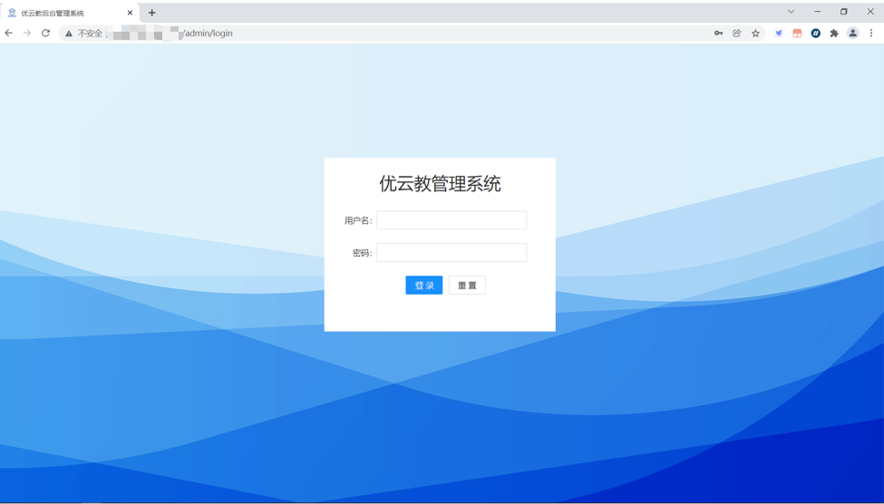
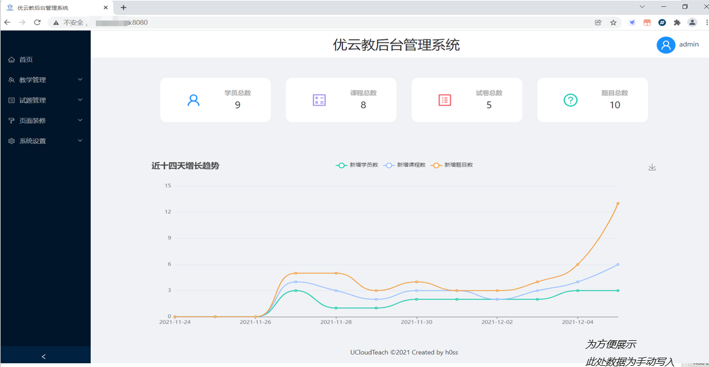
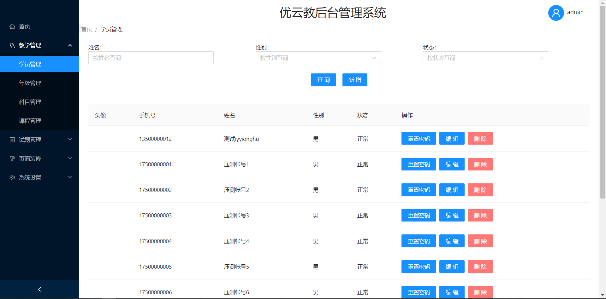
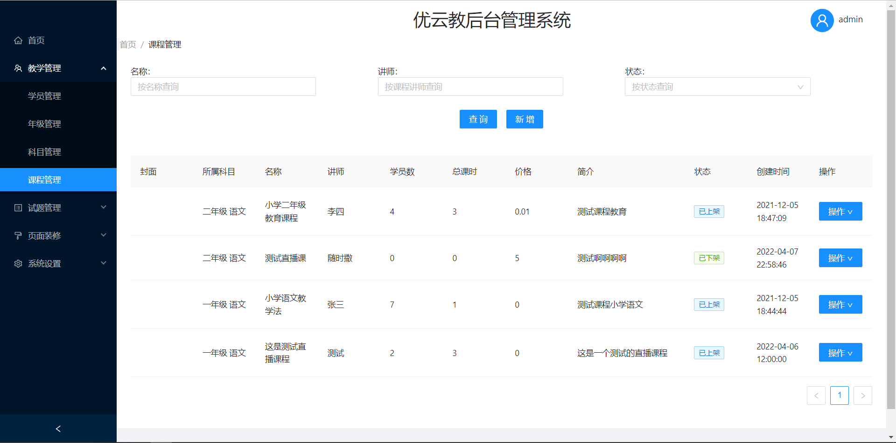
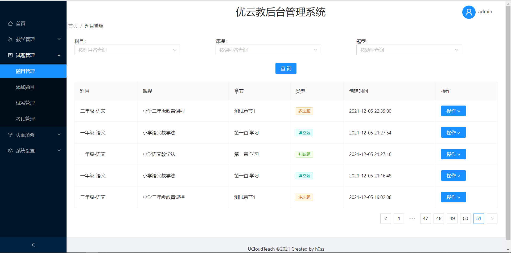
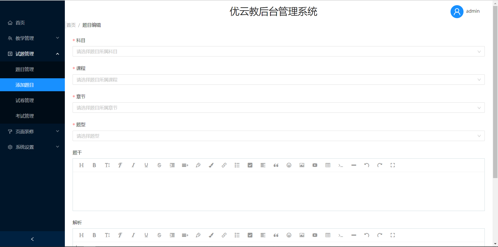
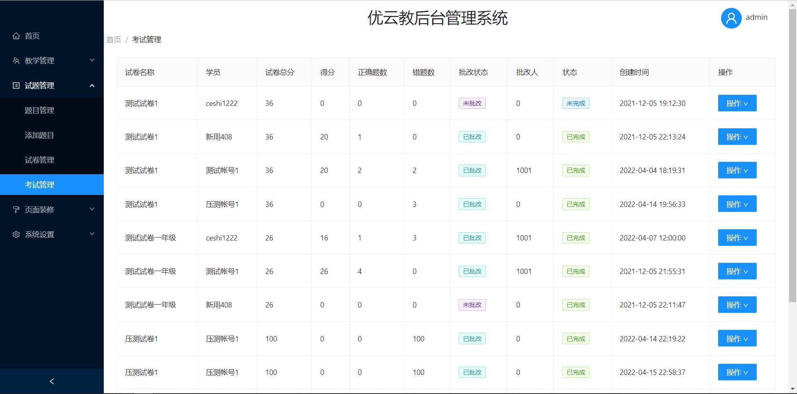

# UCloudTeach-Admin

### 项目介绍
本仓库为优云教在线教育平台管理后台前端项目，技术栈为 Vue3+Ant-Design-Vue+TypeScript ，具体功能请查看项目后台仓库：[UCloudTeach-Monolithic](https://gitee.com/h0ss/ucloud-teach-monolithic)，项目后台基本交互功能都已实现，简单的场景示例如下：

后台登录页面：

项目首页：

学员管理：

课程管理：

题目管理：

考试管理：

### 使用说明

1.  克隆本仓库：`git clone https://gitee.com/h0ss/ucloud-teach-admin.git`
2.  安装依赖：`npm install`
3.  运行项目：`yarn run serve-dev`
4.  确保后端项目已启动，修改`.env.dev`文件中的地址与端口信息
5.  本地构建请在浏览器访问`http://localhost:8080`

